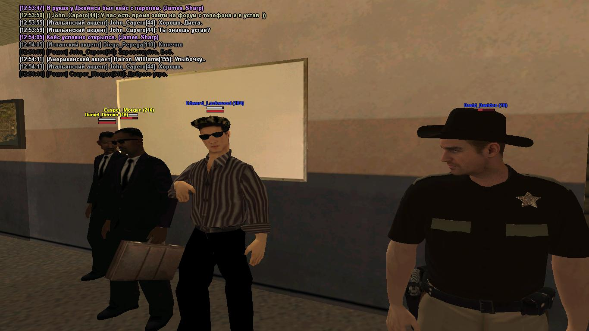

<html>
<body bgcolor="#ffffff">
	<h1 align="center">Проверка Администрацией Губернатора LSPD.</h1> 
	</p1 align="left">Здравствуйте дорогие жители штата San-Andreas. Сегодня Администрация губернатора провела небольшую проверку у LSPD. Проверку проводили очень тчательно и грамотно. Сотрудники LSPD были очень послушны и выполняли все приказы которые им говорили. Что же проверяли сотрудники Администрации губернатора? А они проверяли медецинские карты, знание устава, проверки их речи, так же проверяли их на наличие запрещенных средств ( Наркотики ). Все сотрудники, в том числе и Заместитель шефа, прошли проверку на "Ура"! Запрещённых средств найдено не было, все сотрудники отично сдали устав и речь. Спасибо за вниманеи, газету выдал Ген.Директор СМИ г.Лос-Сантос - Байрон Уильямс. Всех хорошего дня.<p1>
		
  <h2 align="center">Галерея фотографий с участка LSPD</h2>
	
  
  
  
  
  
  
  
  
  
  
  
  
  
</body>
</html>
